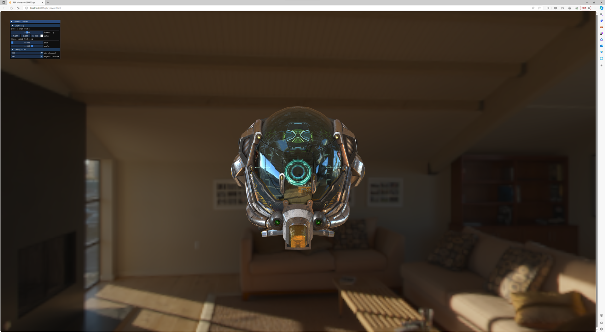

## CG-projects-reference

### Introduction
This is the reference demo for [CG-projects](https://github.com/syby119/CG-projects.git)

### Get the repository
```shell
git clone https://github.com/syby119/CG-projects-reference.git
cd CG-projects-reference
```

### How to run

#### Preliminaries
+ Python >= 3.5

#### Run the demo
Choose a project, say pbr_viewer. To run this demo, use the following command.
```shell
cd browser
python run_webassembly.py pbr_viewer.html
```

The demo will be run on the browser.
<div style="text-align:center">
    
</div>